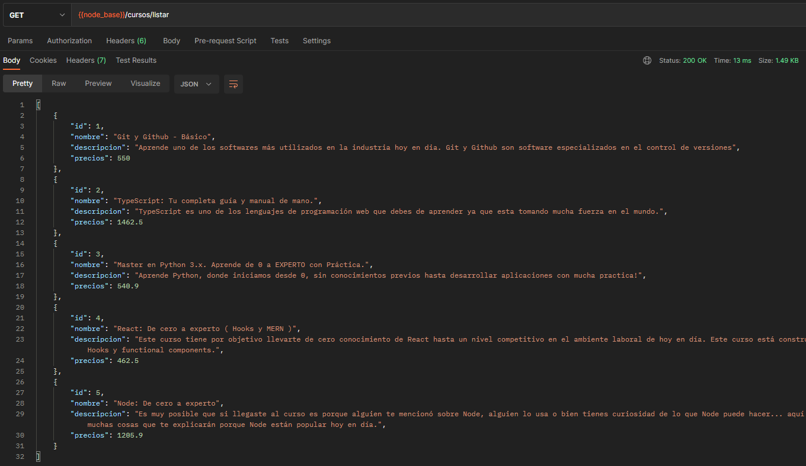
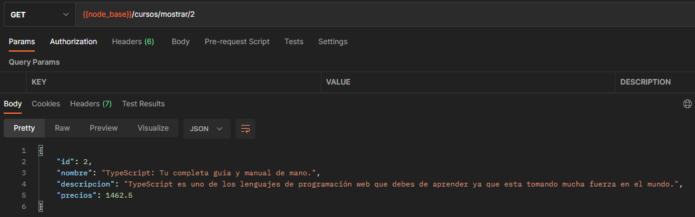
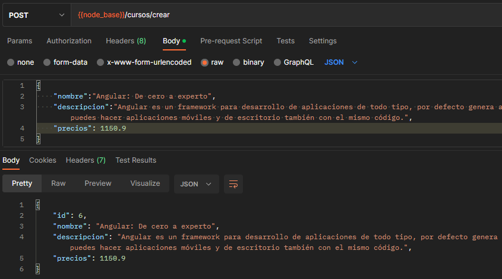
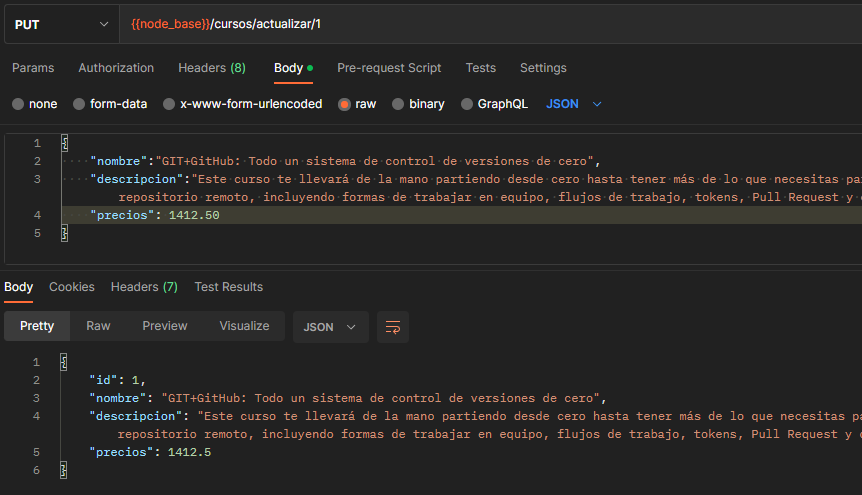
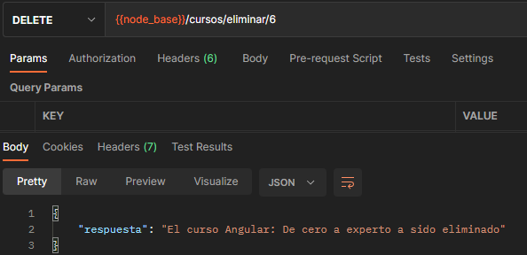

# Tarea: API de Cursos
Descargue el proyecto y utilice el siguiente comando

```bash
npm install
```

## Listar todos los cursos


## Listar un curso


## Crear un curso


## Editar un curso


## Editar un curso


## Eliminar un curso

